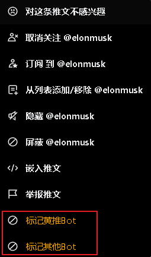

# Twitter Blocker

## Description

This is a chrome extension that can block twitter user. 

## 

## chrome extension style

屏蔽选项，获取github上对应的屏蔽列表，并加入到用户的屏蔽列表中
自定义列表，为用户本地保存

### twitter 
此功能标记并屏蔽，将被屏蔽的用户信息发送共享

## 打包

第一种方法：chrome 开发工具进行打包

第二种方法：使用 grunt-crx 进行打包

    yarn add grunt
    yarn add grunt-crx
    yarn global add grunt-cli
    grunt crxTask

## 安装

第一种方法，直接下载 crx 文件，拖入 chrome 扩展程序中即可

第二种方法，使用开发者模式，加载已解压的扩展程序，选择 extensions 文件夹即可
