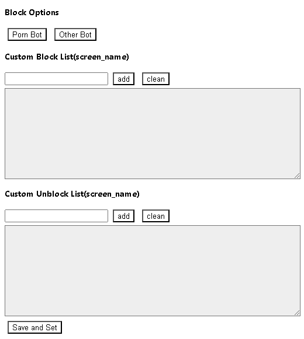
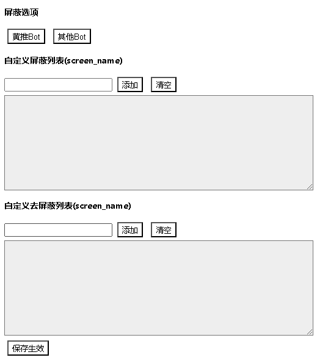
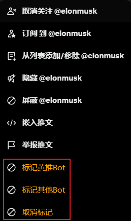
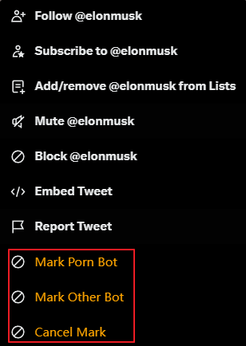
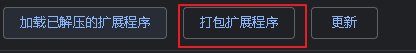

# Twitter Blocker

## Description

This is a chrome extension that can block twitter user. 

## 

## chrome extension style

屏蔽选项，获取github上对应的共享屏蔽列表，并加入到用户的屏蔽列表中

自定义列表，为用户本地保存，不会向外界共享，一般用于自定义屏蔽，或者解除共享屏蔽账号

### twitter 
此功能标记并屏蔽，将被屏蔽的用户信息发送共享

## 打包

第一种方法：chrome 开发工具进行打包

第二种方法：使用 grunt-crx 进行打包

    yarn add grunt
    yarn add grunt-crx
    yarn global add grunt-cli
    grunt crxTask

私钥文件key.pem，需要自己生成，放在 `dist/` 目录下
打包后的文件在 `dist/` 文件夹中

## 安装

第一种方法，直接下载 crx 文件，拖入 chrome 扩展程序中即可(已失效)

第二种方法，使用开发者模式，加载已解压的扩展程序，选择 extensions 文件夹即可

## 使用

### 屏蔽

使用浏览器访问 twitter.com 时，点击”更多“，之后点击”标记“，标记会将此用户屏蔽并发送到对应的共享屏蔽列表中

### 解除屏蔽

使用浏览器访问 twitter.com 时，点击”更多“，之后点击”取消标记“，标记会将此用户接触屏蔽并发送到共享解除屏蔽列表中

### APP

在witter APP浏览时，发现推文下有bot，会在这条推文上点击"红心"进行标记，等之后有机会进行浏览器访问时，用插件进行标记。这样就可以将遇到烦人的bot，共享推友。

## [声明](statement.md)

